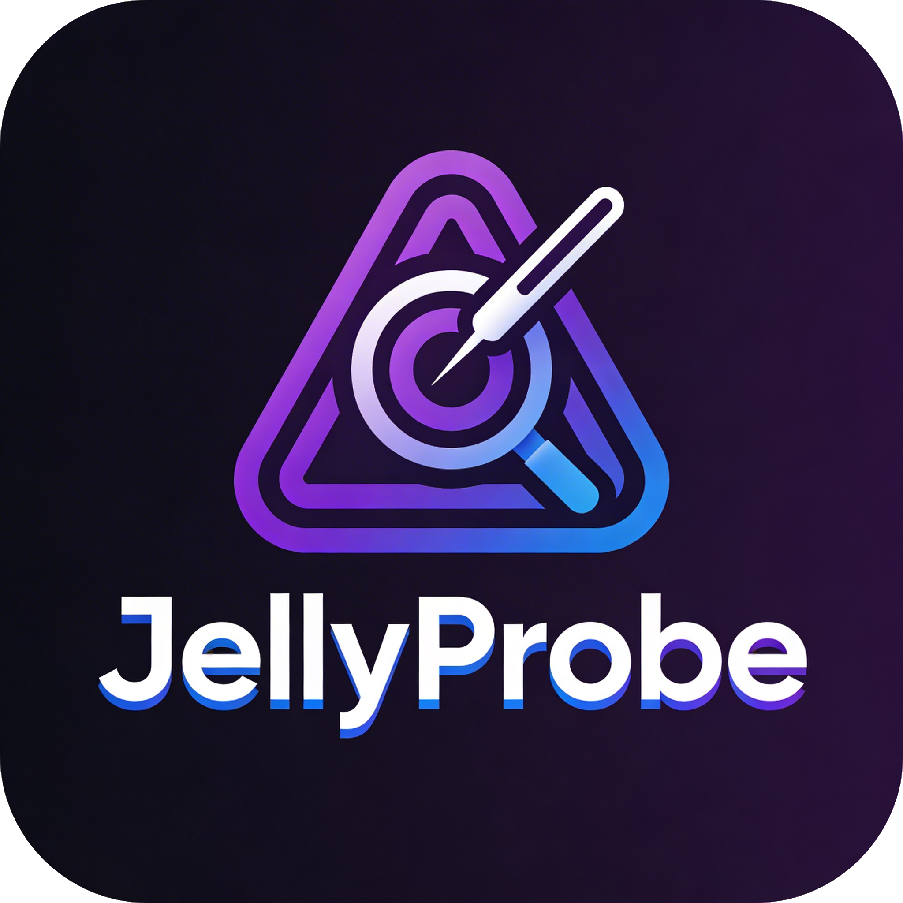
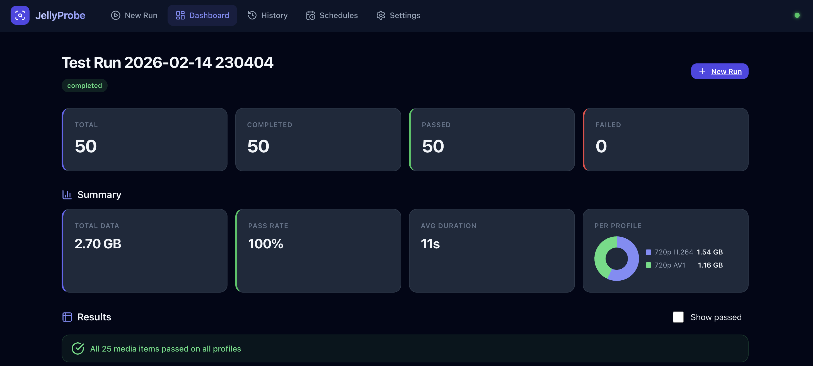

<div align="center">

</div>

[](LICENSE)
[](https://github.com/simno/jellyprobe/actions/workflows/test.yml)
[](https://github.com/simno/jellyprobe/actions/workflows/docker.yml)
[](https://github.com/simno/jellyprobe)
[](https://nodejs.org)

JellyProbe is an automated testing tool for [Jellyfin](https://github.com/jellyfin/jellyfin) servers. It simulates real-world client playback by triggering 
transcoding and validating HLS stream delivery across multiple device profiles, making it easier to identify and 
troubleshoot playback issues with files in your media library or transcoding settings.

This helps server admins verify that their transcoding hardware (QuickSync, NVENC, etc.) and software configuration can 
handle various codecs and bitrates without manual testing.

## Key Features

-   **Automated Playback Tests:** Simulates real HLS streaming sessions to verify transcoding.
-   **Device Profiles:** Define custom profiles (H.264, HEVC, AV1) with specific bitrate and resolution constraints.
-   **Intelligent Library Scanning:** Can detect new media and can create custom test runs.
-   **Parallel Execution:** Load test your Jellyfin server by running many transcoding streams in parallel.
-   **Live Dashboard:** Watch parallel transcoding in real-time with a live video preview grid.
-   **Scheduling:** Set up recurring daily or weekly test runs for your libraries.

## Tech Stack

-   **Backend:** Node.js, Express, better-sqlite3.
-   **Frontend:** Vanilla JS (SPA architecture), Lucide Icons, Hls.js.
-   **Database:** SQLite with WAL mode for high-concurrency logging.

## Screenshot




## Installation

### Using Docker (Recommended)

```bash
docker run -d \
  --name jellyprobe \
  -p 3000:3000 \
  -v /path/to/data:/data \
  -e ENCRYPTION_KEY=your_secret_key \
  -e TZ=Europe/Berlin \
  ghcr.io/simno/jellyprobe:latest
```

#### ENCRYPTION_KEY

The `ENCRYPTION_KEY` is used to encrypt your Jellyfin API key at rest in the SQLite database (AES-256-CBC). Generate one with:

```bash
openssl rand -hex 32
```

**Important:** If you don't set `ENCRYPTION_KEY`, a random key is generated on each startup. This means your stored API key will fail to decrypt after a container restart, and you'll need to re-enter it in Settings. Always set a fixed value for persistent deployments.

#### Timezone

The Docker container defaults to UTC. Scheduled test runs use the container's local time, so set `TZ` to your timezone to ensure schedules trigger at the expected time:

```bash
-e TZ=Europe/Berlin
```

See the [list of valid timezone names](https://en.wikipedia.org/wiki/List_of_tz_database_time_zones).

### Manual Installation

1.  Clone the repository.
2.  Install dependencies: `npm install`.
3.  Copy `.env.example` to `.env` and configure your keys.
4.  Start the server: `npm start`.

## Usage

1.  **Setup:** Enter your Jellyfin URL and API Key in the Settings.
2.  **Profiles:** Create device profiles for the codecs you want to test (e.g., a "Smart TV - 4K HEVC" profile and a "Mobile Remote - 720p" profile).
3.  **Wizard:** Click "New Run" to start a test. You can choose:
    -   **All Media:** Tests every item in selected libraries.
    -   **Recent:** Tests only media added in the last X days.
    -   **Custom:** Search and select specific movies or episodes.
4.  **Monitor:** Use the Dashboard to view progress. Use the **"Show passed"** toggle to hide successful tests and quickly identify playback errors.

## Deployment

### Using Docker Compose (Easiest)

Use the provided `deploy.sh` script for interactive deployment:

```bash
./deploy.sh
```

This script will:
- Check that Docker and Docker Compose are installed
- Create/configure a `.env` file with your Jellyfin server details
- Create a data directory for persistent storage
- Guide you through deployment options (build & start, rebuild, stop, view logs, etc.)
- Display the dashboard URL and health status

**Deployment options:**
1. **Build and start** (recommended for first time) - builds the Docker image and starts the container
2. **Start existing container** - starts a previously built container
3. **Rebuild and restart** - forces a full rebuild and restart
4. **Stop container** - stops the running container
5. **View logs** - stream live container logs

After deployment, access the dashboard at `http://localhost:3000` and configure your Jellyfin connection in Settings.

## Release Process

To create a new release:

```bash
./release.sh [patch|minor|major]
```

**Example:**
```bash
./release.sh patch  # Releases v0.1.1 (if current is v0.1.0)
./release.sh minor  # Releases v0.2.0
./release.sh major  # Releases v1.0.0
```

## Development

-   **Run tests:** `npm test`
-   **Lint code:** `npm run lint`
-   **Dev mode:** `npm run dev` (requires nodemon)

## License

MIT License. See [LICENSE](LICENSE) for details.
